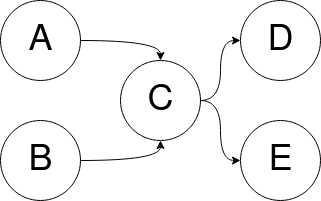
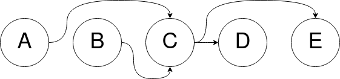

# Topological sort

| 1.0.x:  | 2.0.x:  | 3.0.x  |
| --- | --- | --- |


Topological sort is a PHP library that provides topological sort functionality.

The library uses semantic versioning and has two major versions with the only 
difference being whether the functions get autoloaded. As PHP does not support
autoloading functions, if you choose the 1.x line, the library's files will be
loaded in your autoloader (and all your files using the autoloader). To avoid
that you can choose the 2.x line. If you are using OOP for everything anyway 
the 3.0.x line gives you the same functionality wrapped in a trait.

## Compatibility guarantees

One important note is that the library does not guarantee the same ordering for
the same input between **any** versions. As long as the algorithm produces a 
correct output, we won't consider changes in the produced order a bug. The only 
guarantee provided is that the output will always be a valid ordering of the 
graph's vertices.

To illustrate this point, consider the following graph:



One possible output of a topological sort could be the following:



Notice, that `B, A, C, E, D` and `B, A, C, D, E` are also valid orderings of the 
graph's vertices, and hence it is possible that two consecutive minor versions
would produce different ones.

## Installation

Version 1.x:

```
composer require "chita/topological_sort:1.*"
```

Version 2.x:

```
composer require "chita/topological_sort:2.*"
```
